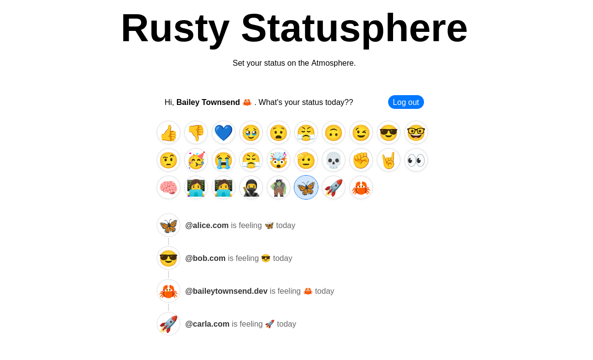

# Rusty Statusphere

Originally taken
from [bluesky-social/atproto-website](https://github.com/bluesky-social/atproto-website/blob/dbcd70ced53078579c7e5b015a26db295b7a7807/src/app/%5Blocale%5D/guides/applications/en.mdx)

> [!NOTE]
> ***This tutorial is based off of the original quick start guide found [here](https://atproto.com/guides/applications).
> The goal is to follow as closely to the original as possible, expect for one small change. It's in Rust 🦀.
> All credit goes to the maintainers of the original project and tutorial. This was made to help you get started with
> using Rust to write applications in the Atmosphere. Parts that stray from the tutorial, or need extra context will be in blocks like this one.***

# Quick start guide to building applications on AT Protocol

[Find the source code on GitHub](https://github.com/fatfingers23/rusty_statusphere_example_app)

In this guide, we're going to build a simple multi-user app that publishes your current "status" as an emoji. Our
application will look like this:



We will cover how to:

- Signin via OAuth
- Fetch information about users (profiles)
- Listen to the network firehose for new data via the [Jetstream](https://docs.bsky.app/blog/jetstream)
- Publish data on the user's account using a custom schema

We're going to keep this light so you can quickly wrap your head around ATProto. There will be links with more
information about each step.

## Introduction

Data in the Atmosphere is stored on users' personal repos. It's almost like each user has their own website. Our goal is
to aggregate data from the users into our SQLite DB.

Think of our app like a Google. If Google's job was to say which emoji each website had under `/status.json`, then it
would show something like:

- `nytimes.com` is feeling 📰 according to `https://nytimes.com/status.json`
- `bsky.app` is feeling 🦋 according to `https://bsky.app/status.json`
- `reddit.com` is feeling 🤓 according to `https://reddit.com/status.json`

The Atmosphere works the same way, except we're going to check `at://` instead of `https://`. Each user has a data repo
under an `at://` URL. We'll crawl all the user data repos in the Atmosphere for all the  "status.json" records and
aggregate them into our SQLite database.

> `at://` is the URL scheme of the AT Protocol. Under the hood it uses common tech like HTTP and DNS, but it adds all of
> the features we'll be using in this tutorial.

## Step 1. Starting with our Actix Web app

Start by cloning the repo and installing packages.

```bash
git clone https://github.com/fatfingers23/rusty_statusphere_example_app.git
cd rusty_statusphere_example_app
cp .env.template .env
cargo run
# Navigate to http://127.0.0.1:8080
```

Our repo is a regular Web app. We're rendering our HTML server-side like it's 1999. We also have a SQLite database that
we're managing with [async-sqlite](https://crates.io/crates/async-sqlite).

Our starting stack:

- [Rust](https://www.rust-lang.org/tools/install)
- Rust web server ([Actix Web](https://actix.rs/))
- SQLite database ([async-sqlite](https://crates.io/crates/async-sqlite))
- HTML Templating ([askama](https://crates.io/crates/askama))

> [!NOTE]
> Along with the above, we are also using a couple of community maintained projects for using rust with the ATProtocol.
> Since these are community maintained I have also linked sponsor links for the maintainers and _highly_ recommend you to
> think
> about sponsoring them.
> Thanks to their work and projects, we are able to create Rust applications in the Atmosphere.
> - ATProtocol client and OAuth
    with [atrium](https://github.com/atrium-rs/atrium) - [sponsor sugyan](https://github.com/sponsors/sugyan)
> - Jetstream consumer
    with [rocketman](https://crates.io/crates/rocketman)- [buy natalie a coffee](https://ko-fi.com/uxieq)

With each step we'll explain how our Web app taps into the Atmosphere. Refer to the codebase for more detailed code
&mdash; again, this tutorial is going to keep it light and quick to digest.

## Step 2. Signing in with OAuth

When somebody logs into our app, they'll give us read & write access to their personal `at://` repo. We'll use that to
write the status json record.

We're going to accomplish this using OAuth ([spec](https://github.com/bluesky-social/proposals/tree/main/0004-oauth)).
Most of the OAuth flows are going to be handled for us using
the [atrium-oauth](https://crates.io/crates/atrium-oauth)
crate. This is the arrangement we're aiming toward:


When the user logs in, the OAuth client will create a new session with their repo server and give us read/write access
along with basic user info.


Our login page just asks the user for their "handle," which is the domain name associated with their account.
For [Bluesky](https://bsky.app) users, these tend to look like `alice.bsky.social`, but they can be any kind of domain (
eg `alice.com`).

```html
<!-- templates/login.html -->
<form action="/login" method="post" class="login-form">
    <input
            type="text"
            name="handle"
            placeholder="Enter your handle (eg alice.bsky.social)"
            required
    />
    <button type="submit">Log in</button>
</form>
```

When they submit the form, we tell our OAuth client to initiate the authorization flow and then redirect the user to
their server to complete the process.

```rust
/** ./src/main.rs **/
/// Login endpoint
#[post("/login")]
async fn login_post(
    request: HttpRequest,
    params: web::Form<LoginForm>,
    oauth_client: web::Data<OAuthClientType>,
) -> HttpResponse {
    // This will act the same as the js method isValidHandle
    match atrium_api::types::string::Handle::new(params.handle.clone()) {
        Ok(handle) => {
            // Initiates the OAuth flow
            let oauth_url = oauth_client
                .authorize(
                    &handle,
                    AuthorizeOptions {
                        scopes: vec![
                            Scope::Known(KnownScope::Atproto),
                            Scope::Known(KnownScope::TransitionGeneric),
                        ],
                        ..Default::default()
                    },
                )
                .await;
            match oauth_url {
                Ok(url) => Redirect::to(url)
                    .see_other()
                    .respond_to(&request)
                    .map_into_boxed_body(),
                Err(err) => {
                    log::error!("Error: {err}");
                    let html = LoginTemplate {
                        title: "Log in",
                        error: Some("OAuth error"),
                    };
                    HttpResponse::Ok().body(html.render().expect("template should be valid"))
                }
            }
        }
        Err(err) => {
            let html: LoginTemplate<'_> = LoginTemplate {
                title: "Log in",
                error: Some(err),
            };
            HttpResponse::Ok().body(html.render().expect("template should be valid"))
        }
    }
}
```

This is the same kind of SSO flow that Google or GitHub uses. The user will be asked for their password, then asked to
confirm the session with your application.

When that finishes, the user will be sent back to `/oauth/callback` on our Web app. The OAuth client will store the
access tokens for the user's server, and then we attach their account's [DID](https://atproto.com/specs/did) to the
cookie-session.

```rust
/** ./src/main.rs **/
/// OAuth callback endpoint to complete session creation
#[get("/oauth/callback")]
async fn oauth_callback(
    request: HttpRequest,
    params: web::Query<CallbackParams>,
    oauth_client: web::Data<OAuthClientType>,
    session: Session,
) -> HttpResponse {
    // Store the credentials
    match oauth_client.callback(params.into_inner()).await {
        Ok((bsky_session, _)) => {
            let agent = Agent::new(bsky_session);
            match agent.did().await {
                Some(did) => {
                    //Attach the account DID to our user via a cookie
                    session.insert("did", did).unwrap();
                    Redirect::to("/")
                        .see_other()
                        .respond_to(&request)
                        .map_into_boxed_body()
                }
                None => {
                    let html = ErrorTemplate {
                        title: "Log in",
                        error: "The OAuth agent did not return a DID. My try relogging in.",
                    };
                    HttpResponse::Ok().body(html.render().expect("template should be valid"))
                }
            }
        }
        Err(err) => {
            log::error!("Error: {err}");
            let html = ErrorTemplate {
                title: "Log in",
                error: "OAuth error, check the logs",
            };
            HttpResponse::Ok().body(html.render().expect("template should be valid"))
        }
    }
}
```

With that, we're in business! We now have a session with the user's repo server and can use that to access their data.

## Step 3. Fetching the user's profile

Why don't we learn something about our user? In [Bluesky](https://bsky.app), users publish a "profile" record which
looks like this:

```rust
pub struct ProfileViewDetailedData {
    pub display_name: Option<String>, // a human friendly name
    pub description: Option<String>,  // a short bio
    pub avatar: Option<String>,       // small profile picture
    pub banner: Option<String>,       // banner image to put on profiles
    pub created_at: Option<String>    // declared time this profile data was added
    // ...
}
```

You can examine this record directly using [atproto-browser.vercel.app](https://atproto-browser.vercel.app). For
instance, [this is the profile record for @bsky.app](https://atproto-browser.vercel.app/at?u=at://did:plc:z72i7hdynmk6r22z27h6tvur/app.bsky.actor.profile/self).

> [!NOTE]  
> In the original tutorial `agent.com.atproto.repo.getRecord` is used, which is
> this [method](https://docs.rs/atrium-api/latest/atrium_api/com/atproto/repo/get_record/index.html) in atrium-api.
> For simplicity we are
> using [agent.api.app.bsky.actor.get_profile](https://docs.rs/atrium-api/latest/atrium_api/app/bsky/actor/get_profile/index.html).
> The original text found here has been moved to [Step 4. Reading & writing records](#step-4-reading--writing-records)
> since it makes more sense in that context.

We're going to use the [Agent](https://crates.io/crates/atrium-oauth) associated with the
user's OAuth session to fetch this record.

Let's update our homepage to fetch this profile record:

```rust
/** ./src/main.rs **/
/// Homepage
#[get("/")]
async fn home(
    _req: HttpRequest,
    session: Session,
    oauth_client: web::Data<OAuthClientType>,
    db_pool: web::Data<Pool>,
    handle_resolver: web::Data<HandleResolver>,
) -> Result<impl Responder> {
    const TITLE: &str = "Home";

    // If the user is signed in, get an agent which communicates with their server
    match session.get::<String>("did").unwrap_or(None) {
        Some(did) => {
            let did = Did::new(did).expect("failed to parse did");
            match oauth_client.restore(&did).await {
                Ok(session) => {
                    let agent = Agent::new(session);

                    // Fetch additional information about the logged-in user
                    let profile = agent
                        .api
                        .app
                        .bsky
                        .actor
                        .get_profile(
                            atrium_api::app::bsky::actor::get_profile::ParametersData {
                                actor: atrium_api::types::string::AtIdentifier::Did(did),
                            }.into(),
                        )
                        .await;

                    // Serve the logged-in view
                    let html = HomeTemplate {
                        title: TITLE,
                        status_options: &STATUS_OPTIONS,
                        profile: match profile {
                            Ok(profile) => {
                                let profile_data = Profile {
                                    did: profile.did.to_string(),
                                    display_name: profile.display_name.clone(),
                                };
                                Some(profile_data)
                            }
                            Err(err) => {
                                log::error!("Error accessing profile: {err}");
                                None
                            }
                        },
                    }.render().expect("template should be valid");

                    Ok(web::Html::new(html))
                }
                Err(err) => {
                    //Unset the session
                    session.remove("did");
                    log::error!("Error restoring session: {err}");
                    let error_html = ErrorTemplate {
                        title: TITLE,
                        error: "Was an error resuming the session, please check the logs.",
                    }.render().expect("template should be valid");

                    Ok(web::Html::new(error_html))
                }
            }
        }
        None => {
            // Serve the logged-out view
            let html = HomeTemplate {
                title: TITLE,
                status_options: &STATUS_OPTIONS,
                profile: None,
            }.render().expect("template should be valid");

            Ok(web::Html::new(html))
        }
    }
}
```

With that data, we can give a nice personalized welcome banner for our user:


```html
<!-- templates/home.html -->
<div class="card">
    
    <form action="/logout" method="post" class="session-form">
        <div>
            Hi,
            
            <strong>{{display_name}}</strong>
            
            <strong>friend</strong>
            .
            What's your status today??
        </div>
        <div>
            <button type="submit">Log out</button>
        </div>
    </form>
    
    <div class="session-form">
        <div><a href="/login">Log in</a> to set your status!</div>
        <div>
            <a href="/login" class="button">Log in</a>
        </div>
    </div>
    
</div>
```

## Step 4. Reading & writing records

You can think of the user repositories as collections of JSON records:


When asking for a record, we provide three pieces of information.

- **repo** The [DID](https://atproto.com/specs/did) which identifies the user,
- **collection** The collection name, and
- **rkey** The record key

We'll explain the collection name shortly. Record keys are strings
with [some restrictions](https://atproto.com/specs/record-key#record-key-syntax) and a couple of common patterns. The
`"self"` pattern is used when a collection is expected to only contain one record which describes the user.

Let's look again at how we read the "profile" record:

```rust
fn example_get_record() {
    let get_result = agent
        .api
        .com
        .atproto
        .repo
        .get_record(
            atrium_api::com::atproto::repo::get_record::ParametersData {
                cid: None,
                collection: "app.bsky.actor.profile"  // The collection
                    .parse()
                    .unwrap(),
                repo: did.into(),                    // The user
                rkey: "self".parse().unwrap(),       // The record key
            }
                .into(),
        )
        .await;
}

```

We write records using a similar API. Since our goal is to write "status" records, let's look at how that will happen:

```rust
fn example_create_record() {
    let did = atrium_api::types::string::Did::new(did_string.clone()).unwrap();
    let agent = Agent::new(session);

    let status: Unknown = serde_json::from_str(
        format!(
            r#"{{"$type":"xyz.statusphere.status","status":"{}","createdAt":"{}"}}"#,
            form.status,
            Datetime::now().as_str()
        )
            .as_str(),
    ).unwrap();

    let create_result = agent
        .api
        .com
        .atproto
        .repo
        .create_record(
            atrium_api::com::atproto::repo::create_record::InputData {
                collection: Status::NSID.parse().unwrap(), // The collection
                repo: did.clone().into(),                  // The user
                rkey: None,                                // The record key, auto creates with None
                record: status,                            // The record from a strong type
                swap_commit: None,
                validate: None,
            }
                .into(),
        )
        .await;
}
```

Our `POST /status` route is going to use this API to publish the user's status to their repo.

```rust
/// "Set status" Endpoint
#[post("/status")]
async fn status(
    request: HttpRequest,
    session: Session,
    oauth_client: web::Data<OAuthClientType>,
    db_pool: web::Data<Pool>,
    form: web::Form<StatusForm>,
) -> HttpResponse {
    const TITLE: &str = "Home";

    // If the user is signed in, get an agent which communicates with their server
    match session.get::<String>("did").unwrap_or(None) {
        Some(did_string) => {
            let did = atrium_api::types::string::Did::new(did_string.clone())
                .expect("failed to parse did");
            match oauth_client.restore(&did).await {
                Ok(session) => {
                    let agent = Agent::new(session);

                    // Construct their status record
                    let status: Unknown = serde_json::from_str(
                        format!(
                            r#"{{"$type":"xyz.statusphere.status","status":"{}","createdAt":"{}"}}"#,
                            form.status,
                            Datetime::now().as_str()
                        )
                            .as_str(),
                    ).unwrap();

                    // Write the status record to the user's repository
                    let create_result = agent
                        .api
                        .com
                        .atproto
                        .repo
                        .create_record(
                            atrium_api::com::atproto::repo::create_record::InputData {
                                collection: "xyz.statusphere.status".parse().unwrap(),
                                repo: did.clone().into(),
                                rkey: None,
                                record: status,
                                swap_commit: None,
                                validate: None,
                            }
                                .into(),
                        )
                        .await;

                    match create_result {
                        Ok(_) => Redirect::to("/")
                            .see_other()
                            .respond_to(&request)
                            .map_into_boxed_body(),
                        Err(err) => {
                            log::error!("Error creating status: {err}");
                            let error_html = ErrorTemplate {
                                title: TITLE,
                                error: "Was an error creating the status, please check the logs.",
                            }
                                .render()
                                .expect("template should be valid");
                            HttpResponse::Ok().body(error_html)
                        }
                    }
                }
                Err(err) => {
                    //Unset the session
                    session.remove("did");
                    log::error!(
                        "Error restoring session, we are removing the session from the cookie: {err}"
                    );
                    let error_html = ErrorTemplate {
                        title: TITLE,
                        error: "Was an error resuming the session, please check the logs.",
                    }
                        .render()
                        .expect("template should be valid");
                    HttpResponse::Ok().body(error_html)
                }
            }
        }
        None => {
            let error_template = ErrorTemplate {
                title: "Error",
                error: "You must be logged in to create a status.",
            }
                .render()
                .expect("template should be valid");
            HttpResponse::Ok().body(error_template)
        }
    }
}
```

Now in our homepage we can list out the status buttons:

```html
<!-- templates/home.html -->
<form action="/status" method="post" class="status-options">
    
    <button
            class="  status-option selected  status-option   status-option   "
            name="status" value="{{status}}">
        {{status}}
    </button>
    
</form>
```

And here we are!


## Step 5. Creating a custom "status" schema

Repo collections are typed, meaning that they have a defined schema. The `app.bsky.actor.profile` type
definition [can be found here](https://github.com/bluesky-social/atproto/blob/main/lexicons/app/bsky/actor/profile.json).

Anybody can create a new schema using the [Lexicon](https://atproto.com/specs/lexicon) language, which is very similar
to [JSON-Schema](http://json-schema.org/). The schemas use [reverse-DNS IDs](https://atproto.com/specs/nsid) which
indicate ownership. In this demo app we're going to use `xyz.statusphere` which we registered specifically for this
project (aka statusphere.xyz).

> ### Why create a schema?
>
> Schemas help other applications understand the data your app is creating. By publishing your schemas, you make it
> easier for other application authors to publish data in a format your app will recognize and handle.

Let's create our schema in the `/lexicons` folder of our codebase. You
can [read more about how to define schemas here](https://atproto.com/guides/lexicon).

```json
/** lexicons/status.json **/
{
  "lexicon": 1,
  "id": "xyz.statusphere.status",
  "defs": {
    "main": {
      "type": "record",
      "key": "tid",
      "record": {
        "type": "object",
        "required": [
          "status",
          "createdAt"
        ],
        "properties": {
          "status": {
            "type": "string",
            "minLength": 1,
            "maxGraphemes": 1,
            "maxLength": 32
          },
          "createdAt": {
            "type": "string",
            "format": "datetime"
          }
        }
      }
    }
  }
}
```

Now let's run some code-generation using our schema:

> [!NOTE] 
> For generating schemas, we are going to
> use [esquema-cli](https://github.com/fatfingers23/esquema?tab=readme-ov-file)
> (Which is a tool I've created from a fork of atrium's codegen).
> This can be installed by running this command
`cargo install esquema-cli --git https://github.com/fatfingers23/esquema.git`
> This is a WIP tool with bugs and missing features. But it's good enough for us to generate Rust types from the lexicon
> schema.

```bash
esquema-cli generate local -l ./lexicons/ -o ./src/ --module lexicons
```


This will produce Rust structs. Here's what that generated code looks like:

```rust
/** ./src/lexicons/xyz/statusphere/status.rs **/
// @generated - This file is generated by esquema-codegen (forked from atrium-codegen). DO NOT EDIT.
//!Definitions for the `xyz.statusphere.status` namespace.
use atrium_api::types::TryFromUnknown;
#[derive(serde::Serialize, serde::Deserialize, Debug, Clone, PartialEq, Eq)]
#[serde(rename_all = "camelCase")]
pub struct RecordData {
    pub created_at: atrium_api::types::string::Datetime,
    pub status: String,
}
pub type Record = atrium_api::types::Object<RecordData>;
impl From<atrium_api::types::Unknown> for RecordData {
    fn from(value: atrium_api::types::Unknown) -> Self {
        Self::try_from_unknown(value).unwrap()
    }
}

```

> [!NOTE] 
> You may have noticed we do not cover the validation part like in the TypeScript version.
> Esquema can validate to a point such as the data structure and if a field is there or not.
> But validation of the data itself is not possible, yet.
> There are plans to add it.
> Maybe you would like to add it?
> https://github.com/fatfingers23/esquema/issues/3

Let's use that code to improve the `POST /status` route:

```rust
/// "Set status" Endpoint
#[post("/status")]
async fn status(
    request: HttpRequest,
    session: Session,
    oauth_client: web::Data<OAuthClientType>,
    db_pool: web::Data<Pool>,
    form: web::Form<StatusForm>,
) -> HttpResponse {
    // ...
    let agent = Agent::new(session);
    //We use the new status type we generated with esquema
    let status: KnownRecord = lexicons::xyz::statusphere::status::RecordData {
        created_at: Datetime::now(),
        status: form.status.clone(),
    }
        .into();

    // TODO no validation yet from esquema
    // Maybe you'd like to add it? https://github.com/fatfingers23/esquema/issues/3

    let create_result = agent
        .api
        .com
        .atproto
        .repo
        .create_record(
            atrium_api::com::atproto::repo::create_record::InputData {
                collection: Status::NSID.parse().unwrap(),
                repo: did.into(),
                rkey: None,
                record: status.into(),
                swap_commit: None,
                validate: None,
            }
                .into(),
        )
        .await;
    // ...
}
```
> [!NOTE] 
> You will notice the first example used a string to serialize to Unknown, you could do something similar with
> a struct you create, then serialize.But I created esquema to make that easier.
> With esquema you can use other provided lexicons
> or ones you create to build out the data structure for your ATProtocol application.
> As well as in future updates it will honor the
> validation you have in the Lexicon.
> Things like string should be 10 long, etc.

## Step 6. Listening to the firehose

> [!IMPORTANT]  
> It is important to note that the original tutorial they connect directly to the firehose, but in this one we use
> [rocketman](https://crates.io/crates/rocketman) to connect to the Jetstream instead. 
> For most use cases this is fine and usually easier when using other clients than the Bluesky provided ones.
> But it is important to note there are some differences that can 
> be found in their introduction to Jetstream article.
> https://docs.bsky.app/blog/jetstream#tradeoffs-and-use-cases

So far, we have:

- Logged in via OAuth
- Created a custom schema
- Read & written records for the logged in user

Now we want to fetch the status records from other users.

Remember how we referred to our app as being like Google, crawling around the repos to get their records? One advantage
we have in the AT Protocol is that each repo publishes an event log of their updates.


Using a [~~Relay~~ Jetstream service](https://docs.bsky.app/blog/jetstream) we can listen to an
aggregated firehose of these events across all users in the network. In our case what we're looking for are valid
`xyz.statusphere.status` records.

```rust
/** ./src/ingester.rs **/
#[async_trait]
impl LexiconIngestor for StatusSphereIngester {
    async fn ingest(&self, message: Event<Value>) -> anyhow::Result<()> {
        if let Some(commit) = &message.commit {
        //We manually construct the uri since jetstream does not provide it
        //at://{users did}/{collection: xyz.statusphere.status}{records key}
        let record_uri = format!("at://{}/{}/{}", message.did, commit.collection, commit.rkey);
        match commit.operation {
            Operation::Create | Operation::Update => {
                if let Some(record) = &commit.record {
                    //We deserialize the record into our Rust struct
                    let status_at_proto_record = serde_json::from_value::<
                        lexicons::xyz::statusphere::status::RecordData,
                    >(record.clone())?;
                    
                    if let Some(ref _cid) = commit.cid {
                        // Although esquema does not have full validation yet,
                        // if you get to this point,
                        // You know the data structure is the same

                        // Store the status
                        // TODO
                    }
                }
            }
            Operation::Delete => {},
        }
    } else {
        return Err(anyhow!("Message has no commit"));
    }
    Ok(())
}
}
```

Let's create a SQLite table to store these statuses:

```rust
/** ./src/db.rs **/
// Create our statuses table
pub async fn create_tables_in_database(pool: &Pool) -> Result<(), async_sqlite::Error> {
    pool.conn(move |conn| {
        conn.execute("PRAGMA foreign_keys = ON", []).unwrap();

        // status
        conn.execute(
            "CREATE TABLE IF NOT EXISTS status (
            uri TEXT PRIMARY KEY,
            authorDid TEXT NOT NULL,
            status TEXT NOT NULL,
            createdAt INTEGER  NOT NULL,
            indexedAt INTEGER  NOT NULL
        )",
            [],
        )
            .unwrap();

// ...
```

Now we can write these statuses into our database as they arrive from the firehose:

```rust
/** ./src/ingester.rs **/
// If the write is a valid status update
if let Some(record) = &commit.record {
    let status_at_proto_record = serde_json::from_value::<
        lexicons::xyz::statusphere::status::RecordData,
    >(record.clone())?;

    if let Some(ref _cid) = commit.cid {
        // Although esquema does not have full validation yet,
        // if you get to this point,
        // You know the data structure is the same
        let created = status_at_proto_record.created_at.as_ref();
        let right_now = chrono::Utc::now();
        // We save or update the record in the db
        StatusFromDb {
            uri: record_uri,
            author_did: message.did.clone(),
            status: status_at_proto_record.status.clone(),
            created_at: created.to_utc(),
            indexed_at: right_now,
            handle: None,
        }
            .save_or_update(&self.db_pool)
            .await?;
    }
}
```

You can almost think of information flowing in a loop:


Applications write to the repo. The write events are then emitted on the firehose where they're caught by the apps and
ingested into their databases.

Why sync from the event log like this? Because there are other apps in the network that will write the records we're
interested in. By subscribing to the event log (via the Jetstream), we ensure that we catch all the data we're interested in &mdash;
including data published by other apps!

## Step 7. Listing the latest statuses

Now that we have statuses populating our SQLite, we can produce a timeline of status updates by users. We also use
a [DID](https://atproto.com/specs/did)-to-handle resolver so we can show a nice username with the statuses:
```rust
/** ./src/main.rs **/
// Homepage
/// Home
#[get("/")]
async fn home(
    session: Session,
    oauth_client: web::Data<OAuthClientType>,
    db_pool: web::Data<Arc<Pool>>,
    handle_resolver: web::Data<HandleResolver>,
) -> Result<impl Responder> {
    const TITLE: &str = "Home";
    // Fetch data stored in our SQLite
    let mut statuses = StatusFromDb::load_latest_statuses(&db_pool)
        .await
        .unwrap_or_else(|err| {
            log::error!("Error loading statuses: {err}");
            vec![]
        });
    
    // We resolve the handles to the DID. This is a bit messy atm,
    // and there are hopes to find a cleaner way
    // to handle resolving the DIDs and formating the handles,
    // But it gets the job done for the purpose of this tutorial.
    // PRs are welcomed!
    
    //Simple way to cut down on resolve calls if we already know the handle for the did
    let mut quick_resolve_map: HashMap<Did, String> = HashMap::new();
    for db_status in &mut statuses {
        let authors_did = Did::new(db_status.author_did.clone()).expect("failed to parse did");
        //Check to see if we already resolved it to cut down on resolve requests
        match quick_resolve_map.get(&authors_did) {
            None => {}
            Some(found_handle) => {
                db_status.handle = Some(found_handle.clone());
                continue;
            }
        }
        //Attempts to resolve the DID to a handle
        db_status.handle = match handle_resolver.resolve(&authors_did).await {
            Ok(did_doc) => {
                match did_doc.also_known_as {
                    None => None,
                    Some(also_known_as) => {
                        match also_known_as.is_empty() {
                            true => None,
                            false => {
                                //also_known as a list starts the array with the highest priority handle
                                let formatted_handle =
                                    format!("@{}", also_known_as[0]).replace("at://", "");
                                quick_resolve_map.insert(authors_did, formatted_handle.clone());
                                Some(formatted_handle)
                            }
                        }
                    }
                }
            }
            Err(err) => {
                log::error!("Error resolving did: {err}");
                None
            }
        };
    }
        // ...
```
>[!NOTE] 
> We use a newly released handle resolver from atrium.
> Can see
> how it is set up in [./src/main.rs](https://github.com/fatfingers23/rusty_statusphere_example_app/blob/a13ab7eb8fcba901a483468f7fd7c56b2948972d/src/main.rs#L508)


Our HTML can now list these status records:

```html
<!-- ./templates/home.html -->

<div class=" status-line no-line  status-line  ">
    <div>
        <div class="status">{{status.status}}</div>
    </div>
    <div class="desc">
        <a class="author"
           href="https://bsky.app/profile/{{status.author_did}}">{{status.author_display_name()}}</a>
        
        is feeling {{status.status}} today
        
        was feeling {{status.status}} on {{status.created_at}}
        
    </div>
</div>

`
})}
```


## Step 8. Optimistic updates

As a final optimization, let's introduce "optimistic updates."

Remember the information flow loop with the repo write and the event log?


Since we're updating our users' repos locally, we can short-circuit that flow to our own database:


This is an important optimization to make, because it ensures that the user sees their own changes while using your app.
When the event eventually arrives from the firehose, we just discard it since we already have it saved locally.

To do this, we just update `POST /status` to include an additional write to our SQLite DB:

```rust
/** ./src/main.rs **/
/// Creates a new status
#[post("/status")]
async fn status(
    request: HttpRequest,
    session: Session,
    oauth_client: web::Data<OAuthClientType>,
    db_pool: web::Data<Arc<Pool>>,
    form: web::Form<StatusForm>,
) -> HttpResponse {
    //...
    let create_result = agent
        .api
        .com
        .atproto
        .repo
        .create_record(
            atrium_api::com::atproto::repo::create_record::InputData {
                collection: Status::NSID.parse().unwrap(),
                repo: did.into(),
                rkey: None,
                record: status.into(),
                swap_commit: None,
                validate: None,
            }
                .into(),
        )
        .await;

    match create_result {
        Ok(record) => {
            let status = StatusFromDb::new(
                record.uri.clone(),
                did_string,
                form.status.clone(),
            );

            let _ = status.save(db_pool).await;
            Redirect::to("/")
                .see_other()
                .respond_to(&request)
                .map_into_boxed_body()
        }
        Err(err) => {
            log::error!("Error creating status: {err}");
            let error_html = ErrorTemplate {
                title: "Error",
                error: "Was an error creating the status, please check the logs.",
            }
                .render()
                .expect("template should be valid");
            HttpResponse::Ok().body(error_html)
        }
    }
    //...
}
```

You'll notice this code looks almost exactly like what we're doing in `ingester.rs`.

## Thinking in AT Proto

In this tutorial we've covered the key steps to building an atproto app. Data is published in its canonical form on
users' `at://` repos and then aggregated into apps' databases to produce views of the network.

When building your app, think in these four key steps:

- Design the [Lexicon](#) schemas for the records you'll publish into the Atmosphere.
- Create a database for aggregating the records into useful views.
- Build your application to write the records on your users' repos.
- Listen to the firehose to aggregate data across the network.

Remember this flow of information throughout:


This is how every app in the Atmosphere works, including the [Bluesky social app](https://bsky.app).

## Next steps

If you want to practice what you've learned, here are some additional challenges you could try:

- Sync the profile records of all users so that you can show their display names instead of their handles.
- Count the number of each status used and display the total counts.
- Fetch the authed user's `app.bsky.graph.follow` follows and show statuses from them.
- Create a different kind of schema, like a way to post links to websites and rate them 1 through 4 stars.

[Ready to learn more? Specs, guides, and SDKs can be found here.](https://atproto.com/)

>[!NOTE]
> Thank you for checking out my version of the Statusphere example project!
> There are parts of this I feel can be improved on and made more efficient,
> but I think it does a good job for providing you with a starting point to start building Rust applications in the Atmosphere.
> See something you think could be done better? Then please submit a PR! 
> [@baileytownsend.dev](https://bsky.app/profile/baileytownsend.dev)